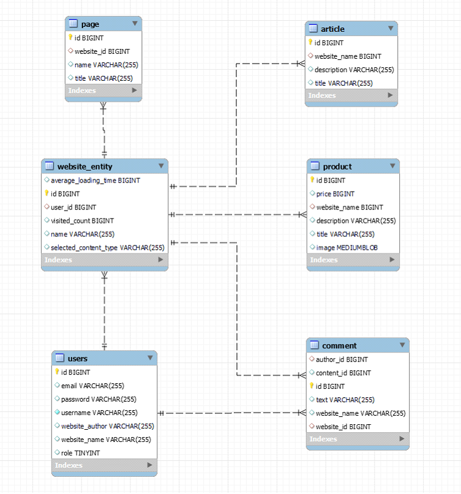
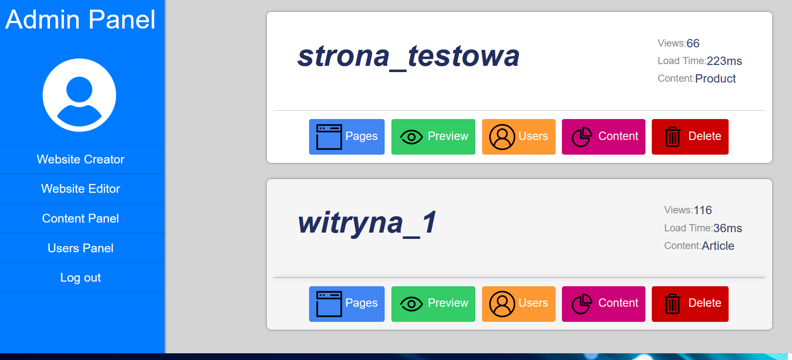
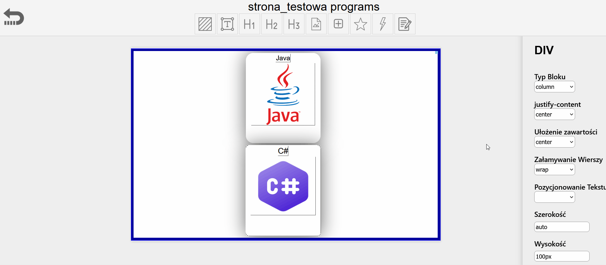
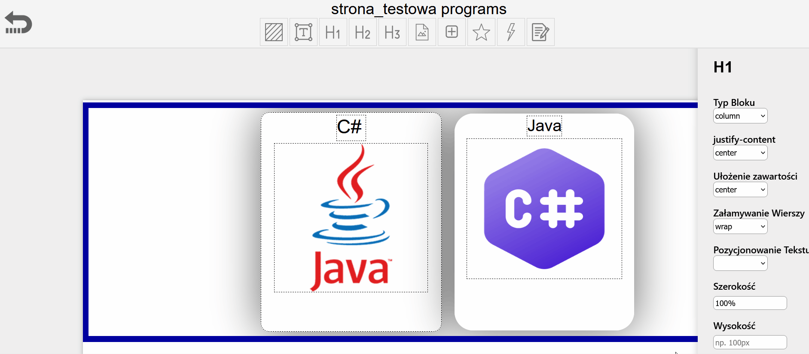
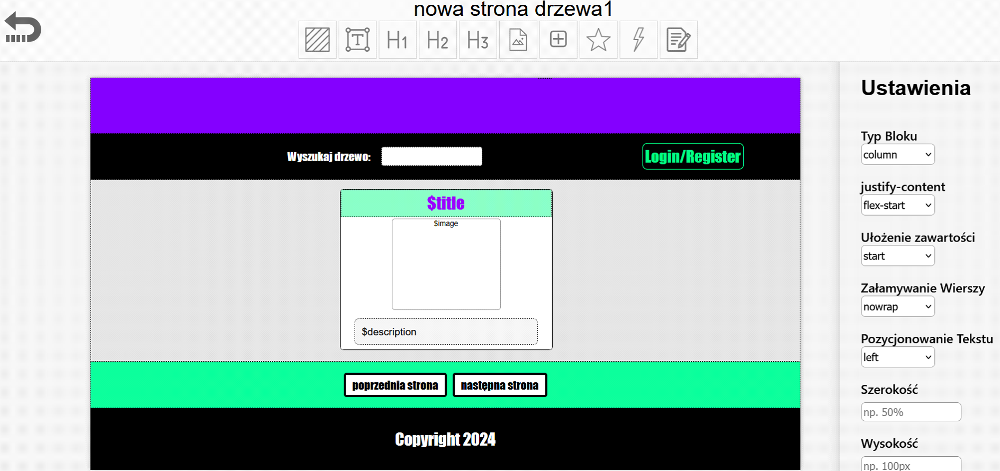
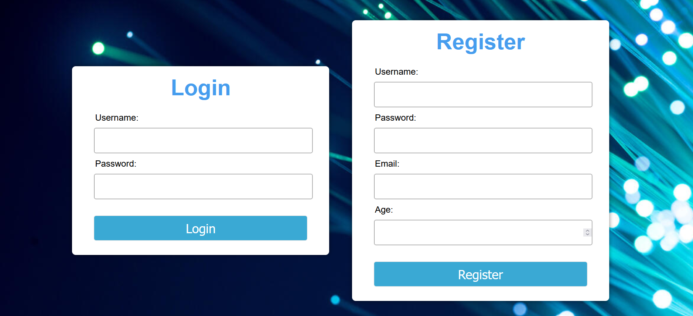
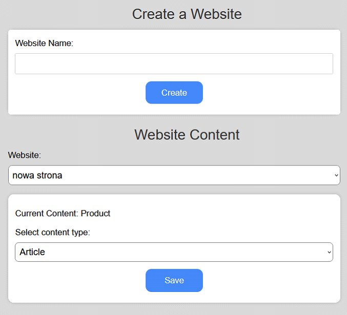
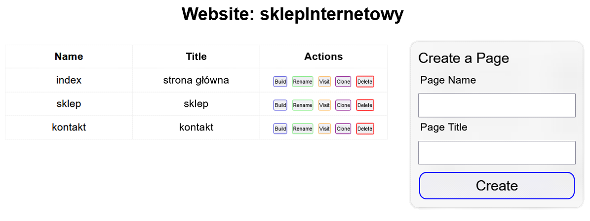
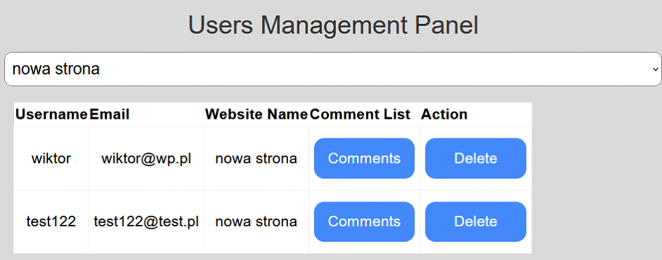
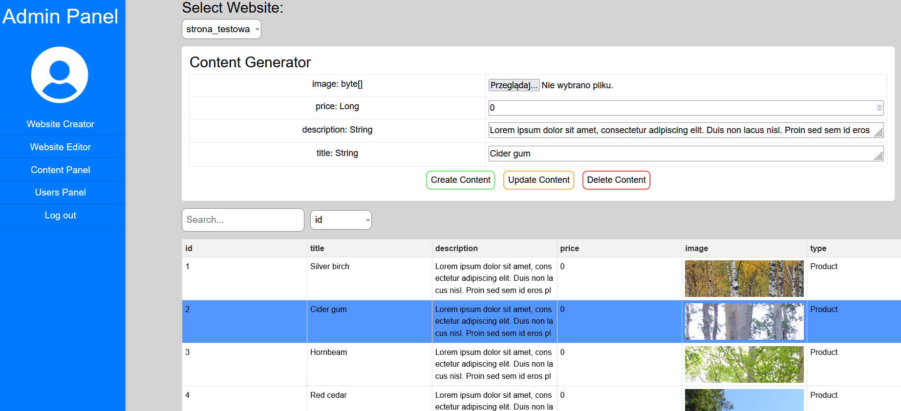

# Simple CMS with Website Generator for Engineering Thesis
Used Technology:
```
Java 20
Spring Boot v.3.1.2
Spring Security with JWT
Javascript (native)
HTML&CSS
MySQL
```
## Database Design (MYSQL):


## Main Panel:


## Website Builder:


### Simple Webiste builded:

#### Imortant info about this builded website:
It cointains schema for website content. There is a main object with a `$title` `$image` and `$description` labels which are used to populating website with a content. Website has also build in mechanism for pagination and user authentication (Login/Register). Authenticated User can make/update/remove comments for each Concent. On the top there is also a SearchBar which can be configured to search content by specific label. 
## Other Panels:
### Admin Panel Authorization:

### Website Creator:

### Website Manager with a Page Creator:

### Users Management Panel:

### Content Generator:
